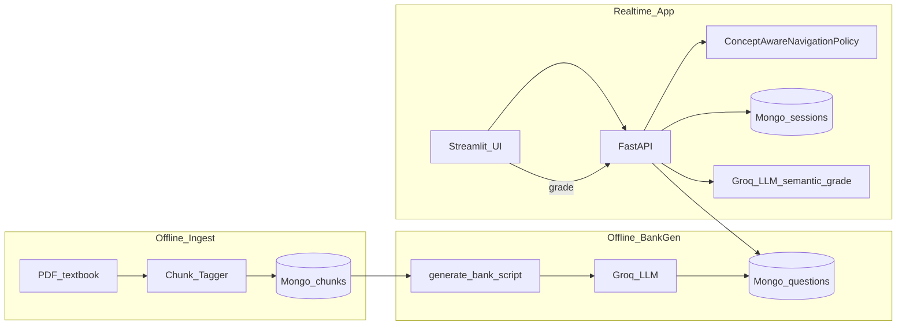

# Intelligent Assessment Engine: Architecture Refactor Plan

## Current codebase reality (constraints)

| Area | What exists today | Gap vs your spec |
|------|-------------------|------------------|
| API | Single file [`api.py`](c:/Users/yenul/Documents/Research%20Project/intelligent-assessment-engine/api.py): `/generate_assessment`, `/grade_assessment` | No session id, no Mongo query, no RL outputs; generation ignores payload topic and hardcodes difficulty `6` and `MCQ`. |
| RAG / chunks | [`rag/document_loader.py`](c:/Users/yenul/Documents/Research%20Project/intelligent-assessment-engine/rag/document_loader.py): PDF → `RecursiveCharacterTextSplitter` → Chroma | No chapter/page/sub-concept metadata; no page-mapping table. |
| Questions | [`rag/generator.py`](c:/Users/yenul/Documents/Research%20Project/intelligent-assessment-engine/rag/generator.py): live LLM + Chroma; `MOCK_TOPICS` | Not pre-generated; no DOK mapping; Fill-in-blank differs from Multi-Blank (3–5 blanks); no Atlas persistence. |
| Grading | [`api.py`](c:/Users/yenul/Documents/Research%20Project/intelligent-assessment-engine/api.py) exact MCQ/T-F; [`rag/grader.py`](c:/Users/yenul/Documents/Research%20Project/intelligent-assessment-engine/rag/grader.py) Groq JSON for everything else | Multi-blank routing must be deterministic; prompts should live outside Python strings. |
| RL | [`rl_agent/env.py`](c:/Users/yenul/Documents/Research%20Project/intelligent-assessment-engine/rl_agent/env.py): Gymnasium + simulated IRT; [`main_pipeline.py`](c:/Users/yenul/Documents/Research%20Project/intelligent-assessment-engine/main_pipeline.py) imports **nonexistent** `generate_mcq` | Action/obs spaces do not match your concept-aware MDP; simulator is not the real-assessment controller. |
| Deps | [`requirements.txt`](c:/Users/yenul/Documents/Research%20Project/intelligent-assessment-engine/requirements.txt) empty | Must be pinned once structure stabilizes. |
| Cache hygiene | [`rag/__pycache__/`](c:/Users/yenul/Documents/Research%20Project/intelligent-assessment-engine/rag/__pycache__), [`rl_agent/__pycache__/`](c:/Users/yenul/Documents/Research%20Project/intelligent-assessment-engine/rl_agent/__pycache__), `.gitignore` missing `__pycache__/` | Remove committed bytecode; ignore going forward. |

**MongoDB / Google login clarification (important):** Google sign-in authenticates access to the **MongoDB Atlas control plane/UI**. The FastAPI application still connects with a **`MONGODB_URI`** (recommended: database user credentials or Atlas **driver** connection string stored in `.env`). That URI is orthogonal to Google OAuth and must never be committed. No personal identifiers belong in repo or plan artifacts.

---

## Target package layout (SOLID-aligned)

Proposal: installable Python package `iae` (or `assessment_engine`) under `src/iae/` to avoid import path chaos and make boundaries explicit.

```text
src/iae/
  core/                 # Domain models + protocols (typing.Protocol / ABCs)
    models.py           # Question, Chunk, SessionState, RlState, RlAction, GradeResult
    protocols.py        # IChunkRepository, IQuestionBank, IRlPolicy, IGradingService, ILlmClient
    curriculum.py       # Typed chapter/page map constants + SubConcept defs
  application/        # Use cases (Orchestration only; depend on protocols)
    sessions.py         # initialize_session, next_question_selection, submit telemetry
    grading.py          # GradePayload → deterministic vs semantic branches
  infrastructure/
    mongo/              # pymongo repos: questions, chunks (optional), sessions
    rag/
      pdf_loader.py     # LangChain loader + splitter hooks
      chunk_tagger.py   # attach Chapter_Name + Sub_Concept (+ page range inheritance)
      vector_store.py   # Chroma helpers (generation-time retrieval only OR optional local FAISS)
    llm/
      groq_client.py    # thin wrapper implementing ILlmClient
  rl/
    policy.py           # ConceptAwareNavigationPolicy implementing IRlPolicy
    telemetry.py        # compute rolling accuracy / streak normalization helpers
  api/
    main.py             # FastAPI factory + routers
    routes/
      assessment.py     # REST endpoints grouped
      health.py
  prompts/              # DEDICATED prompt assets (committed text)
    question_bank_generation/
      mcq.jinja2.txt    # or .md templates
      short_answer.jinja2.txt
      ...
    grading/
      semantic_short_answer.jinja2.txt
  config/
    default.yaml        # curriculum page map source of truth OR JSON if you prefer
    app.yaml.example    # MAX_QUESTIONS, thresholds, MODEL_NAME — not secrets
scripts/
  ingest_and_tag_chunks.py    # runnable pipeline: PDF → Mongo `chunks` (and/or Chroma)
  generate_bank.py           # standalone manual job you requested
demo/
  streamlit_app.py            # cohesive UI (thin; calls backend only)

tests/
  unit/...
```

**SOLID mapping (lite, intentional):**

- **S**: Each module owns one reason to change (`chunk_tagger` vs `grading` vs `policy`).
- **O**: Extend via new `IRlPolicy` implementations (e.g. future trained policy) without editing FastAPI routes.
- **L**: Repos return domain models consistently; swaps (Motor vs pymongo sync) isolated.
- **I**: Small protocols per capability (`ILlmJson`, `IQuestionBank`).
- **D**: `application/*` imports only protocols; wires concrete infra in [`api/main.py`](c:/Users/yenul/Documents/Research%20Project/intelligent-assessment-engine/api.py)/composition root via a single `bootstrap.py`/`container.py`.

**Dead code removal (during migration):**

- Delete committed `__pycache__/` and `.pyc` files from `rag/` and `rl_agent/`.
- Add `__pycache__/`, `*.py[cod]`, `.pytest_cache/` to [`.gitignore`](c:/Users/yenul/Documents/Research%20Project/intelligent-assessment-engine/.gitignore).
- Retire [`main_pipeline.py`](c:/Users/yenul/Documents/Research%20Project/intelligent-assessment-engine/main_pipeline.py) as the integrated entrypoint (broken import today); Fold any still-useful RL training artifact under `legacy/` **only if** you keep PPO experimentation—otherwise drop `stable-baselines3` runtime dependency entirely.
- Remove unused imports (`HuggingFaceEndpoint` in [`rag/generator.py`](c:/Users/yenul/Documents/Research%20Project/intelligent-assessment-engine/rag/generator.py)) during refactor.
- Keep root [`api.py`](c:/Users/yenul/Documents/Research%20Project/intelligent-assessment-engine/api.py) temporarily as thin `uvicorn` shim re-export or delete after `uvicorn iae.api.main:app`.

---

## 1) Database and chunking (RAG tagging)

### 1.1 Curriculum artifact (single source of truth)

Add [`src/iae/config/curriculum.(yaml|json)`](c:/Users/yenul/Documents/Research%20Project/intelligent-assessment-engine/) encoding your **chapter → inclusive page-range** dictionary (canonical **1-based PDF page indices** aligned with [`PyPDFLoader`](https://python.langchain.com/docs/integrations/document_loaders/pypdf) metadata; validate once against the TOC of `data/grade_6_science.pdf`).

Embed **exactly `Chapter_Name`** strings matching your naming (e.g. `"Wonders of the Living World"`).

### 1.2 Sub-concepts (3–5 broad per chapter)

**Approach:**

- One-time-assisted extraction (LLM) + human-editable YAML/JSON artifact `subconcepts_by_chapter` stored beside curriculum (committed). Each entry: `{id, chapter, name, rationale}` suitable for tagging.
- **Chunk tagging assignment:** deterministic + cheap scalability:
  - Embed each Sub_Concept description with the same embedding model used for chunks.
  - Assign each chunk `Sub_Concept = argmax cosine(chunk_embedding, concept_embeddings within that chapter)` (fallback: `UNKNOWN` logged for manual fix).

### 1.3 Ingest pipeline script (`ingest_and_tag_chunks.py`)

- Load [`data/grade_6_science.pdf`](c:/Users/yenul/Documents/Research%20Project/intelligent-assessment-engine/data/grade_6_science.pdf).
- Derive **`Chapter_Name`** from page number vs curriculum ranges.
- Split with tuned `RecursiveCharacterTextSplitter`; persist **metadata** `{source, page_start, page_end, Chapter_Name, Sub_Concept}`.
- Write to **Mongo collection `chunks`** (recommended Atlas collection for queryability/versioning); optionally rebuild a **local Chroma** strictly as a retrieval cache—Mongo remains canonical if you prefer one DB.

---

## 2) Pre-generation question bank (`scripts/generate_bank.py`)

Manual job; idempotent-ish via deterministic keys.

### Data model (`questions` collection)

Minimum fields:

- `_id`
- `chapter_name`, `sub_concept` (denormalized string or `sub_concept_id`)
- `dok_level` **1–4** (your mapping to Webb’s DOK)
- `question_type` ∈ `{MCQ, ShortAnswer, MultiBlank, TrueFalse}`
- `prompt` / structured payload:
  - **MCQ:** stem, exactly 4 options (A–D), `correct_answer` key `"A"|"B"|"C"|"D"`
  - **ShortAnswer:** stem, `ideal_answer`, `keywords[]`
  - **MultiBlank:** stem template with placeholders, ordered `answers[]`, count 3–5
  - **TrueFalse:** stem, boolean or `"True"|"False"`
- **RAG grounding:** `chunk_ids[]` or `retrieval_context_hashes[]` provenance fields
- `created_at`

### Generation mechanics

Outer loop:

`for chapter in CURRICULUM:for sub in SUBCONCEPTS[chapter]:for dok in [1..4]:for qtype in TYPES:k in [generation_batch_size]`

- Pull top-k chunks filtered by `{Chapter_Name, Sub_Concept}` from Mongo/Chroma.
- Render prompt from **`src/iae/prompts/question_bank_generation/*.jinja2.txt`** passing chapter, concept, dok rubric cues, excerpts.
- Parse JSON strictly (Pydantic models); discard/repair malformed samples with bounded retries.

### Indexes (Atlas)

- Compound index on `(chapter_name, sub_concept, dok_level, question_type)`

---

## 3) RL agent (concept-aware navigation) + server-side session selection

Replace the simulated [`StudentEnv`](c:/Users/yenul/Documents/Research%20Project/intelligent-assessment-engine/rl_agent/env.py) as the runtime controller unless you explicitly want to **retrain** a policy on the real MDP later.

### 3.1 Heuristic MDP-style policy (recommended v1)

Implement `ConceptAwareNavigationPolicy` against your contract:

**Input state (normalized where applicable):**

- `Current_Chapter` (categorical)
- `Time_Taken` (per last item, seconds → clamp + scale 0..1)
- `Accuracy_Score` (last item 0..1; policy also uses rolling window for stability)
- `Streak` (integer → bounded feature)
- `Current_Difficulty` (DOK 1–4)
- `Current_Sub_Concept`

**Output action:**

- `Target_Chapter`
- `Next_Difficulty_Level` (1–4)
- `Next_Question_Type`
- `Next_Sub_Concept`

**Cold start (question 1):** DOK **2**, random `Sub_Concept` within the **UI-selected chapter** (session field `scope_chapter`).

**80–85% accuracy targeting (operationalized):** maintain rolling accuracy `A` over last `N` attempts (e.g. N=5). Simple interpretable rules:

- If `A < 0.75` → decrease DOK (min 1), bias sub-concept toward last wrong concept; allow `Target_Chapter` to fall back to prerequisite chapter list you define in config (optional small static map) or stay in-chapter.
- If `0.80 <= A <= 0.85` → small exploration: rotate sub-concept; keep DOK ±0.
- If `A > 0.90` → increase DOK (max 4) or switch sub-concept within chapter.
- **Question type** mixture: enforce coverage quotas per session (e.g. at least one of each type every 10 items) + random tie-break.

This is **diagnostic navigation** consistent with ZPD/flow literature without long-term mastery modeling (explicitly out of scope).

### 3.2 Session store (stateless frontend)

Mongo `sessions` collection:

- `session_id` (UUID)
- `scope_chapter` (from UI)
- `used_question_ids: list[str]`
- `last_rl_state` snapshot + `last_action` (for telemetry panel)
- `ttl` / `updated_at` (Atlas TTL index optional)

Backend selection query:

`find_one` with filter matching action fields + `id not in used_question_ids`; if empty, relax filters in a documented order (type → sub_concept → dok → chapter) while still excluding used ids.

---

## 4) Evaluation engine

| Type | Strategy |
|------|----------|
| MCQ / TrueFalse | Normalized string compare (extend current logic in [`api.py`](c:/Users/yenul/Documents/Research%20Project/intelligent-assessment-engine/api.py)) |
| MultiBlank | Deterministic: split student response into ordered blanks (document delimiter e.g. `|` or JSON list from UI); per-blank normalize; overall score = correct/total |
| ShortAnswer | **LLM-as-judge** 0..1 using dedicated prompt file; keep temperature 0; return feedback string |

Move grader prompt out of [`rag/grader.py`](c:/Users/yenul/Documents/Research%20Project/intelligent-assessment-engine/rag/grader.py) into `prompts/grading/semantic_short_answer.jinja2.txt`.

---

## 5) Streamlit demo UI (cohesive, minimal “game” chrome)

Replace/relocate [`demo_ui.py`](c:/Users/yenul/Documents/Research%20Project/intelligent-assessment-engine/demo_ui.py) to `demo/streamlit_app.py`.

- **Start:** chapter dropdown bound to curriculum list; `POST /sessions` returns `session_id`.
- **Loop:** `MAX_QUESTIONS` read from config file (e.g. [`config/app.yaml`](c:/Users/yenul/Documents/Research%20Project/intelligent-assessment-engine/)) via small loader; not hardcoded.
- **Calls:** `POST /sessions/{id}/next` returns `{question_document, rl_debug}` where `rl_debug` mirrors Inputs → Policy internals → Outputs.
- **Layout:** wide layout; remove celebratory/confetti-like affordances (`st.balloons`, excessive emoji telemetry) unless you insist—align with “diagnostic instrument” aesthetic.
- **Final:** totals + per-item raw review (your existing pattern in lines 148–190, adapted to backend-provided bundle).

---

## End-to-end flow (mermaid)



---

## Packages / libraries you should expect

**Retain / formalize:** `fastapi`, `uvicorn[standard]`, `pydantic`, `pydantic-settings`, `python-dotenv`, `httpx` or `requests`, `streamlit`, `numpy`, LangChain loaders/splitters you already rely on (`langchain_community`, `langchain_*`), `sentence-transformers` / `langchain-huggingface` embeddings strategy (keep one consistent embedding model name in config).

**Add:** **`pymongo`** (MongoDB synchronous driver fits current scale; **`motor`** only if we later want async aggregation-heavy routes).

**Make optional:** `chromadb` (only if keeping Chroma for retrieval ergonomics beside Mongo).

**Remove from default runtime:** `gymnasium`, `stable-baselines3` **if** heuristic policy replaces PPO pathway for production demos (keep listed under `[project.optional-dependencies]`/`dev` if lab training persists).

---

## Architectural summary & educational theory (your review section)

### Architecture snapshot

Offline:

1. Tagged chunks in Mongo (+ optional embeddings store) derived from TOC-driven **page-to-chapter** mapping plus **semantic assignment** of chunks to LLM-assisted **broad Sub_Concepts**.
2. `generate_bank.py` fills **`questions`** with four types × four DOK levels per sub-concept, grounded on chapter-filtered excerpts.

Realtime:

Streamlit obtains a **`session_id`**. FastAPI restores session doc, computes next RL action from observable student telemetry (latency, correctness, streak, current concept/difficulty), queries Mongo for an unused matching item, persists `used_question_ids`, grades responses with **deterministic** structural items and **LLM semantic** short answers only.

### Educational grounding (bounded to your stated scope)

- **Webb’s Depth of Knowledge (DOK 1–4)** operationalized as **`dok_level` 1–4** generation labels and **`Next_Difficulty_Level`** control signal (explicit mapping table in prompts + policy docstring).
- **Zone of Proximal Development / Flow (short-horizon)** approximated via a **rolling accuracy band ~80–85%**, steering difficulty and concept navigation without Bayesian Knowledge Tracing or longitudinal profiling.
- **Formative diagnostics:** item-level feedback + raw telemetry aggregation only (no mastery prediction backlog).

---

## Credential / tooling note outside your list

Anything not listed above defaults to engineering plumbing only (e.g. **Jinja2** for prompts if you adopt templates, **`pyyaml`** for curriculum YAML). Atlas **Vector Search** is optional—not required when using local embeddings assignment.
